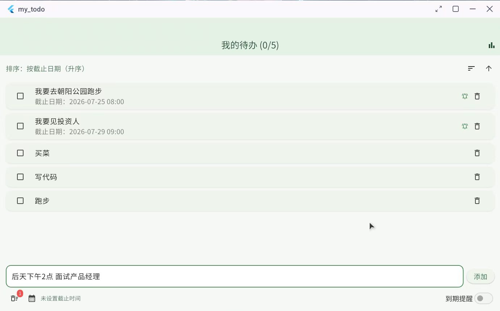
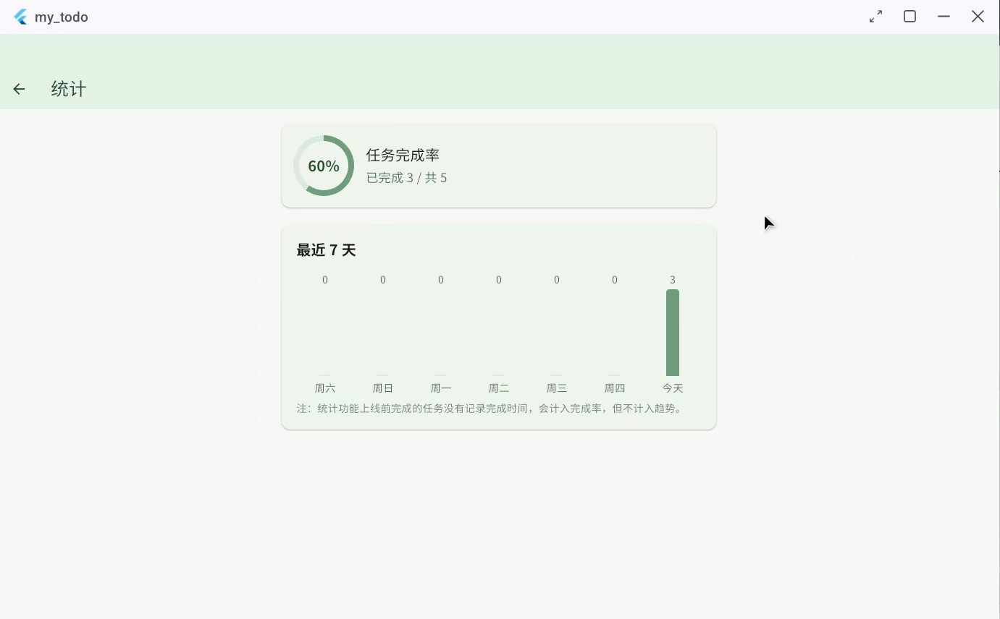

# 我的待办 · my_todo

> 极简、本地优先的跨平台待办清单 — 支持中文自然语言快速添加、到期提醒与完成统计。
> A minimalist, local-first cross-platform to-do app built with Flutter.

<p align="center">
  
  &nbsp;&nbsp;
  
</p>

## ✨ 特性

- 🗣️ **自然语言快速添加** — 输入「大后天下午2点 面试产品经理」，自动拆出任务标题和截止时间
- ☁️ **可选云端兜底** — 本地规则不认识的时间写法可交给云端识别，默认关闭
- ⏰ **到期提醒** — 本地系统通知，到点提醒；权限被拒也不丢任务，仅关闭提醒
- 📊 **完成统计** — 任务完成率 + 最近 7 天完成趋势
- 🗑️ **回收站** — 删除后 7 天内可恢复到原位置，超期自动清理
- 🔀 **灵活排序** — 按添加顺序 / 截止日期 / 完成状态，支持升降序，偏好本地保存
- 💾 **本地优先** — 任务数据只存本地；不开启云端识别时，解析也完全留在设备上
- 🎯 **一套代码跨平台** — Android / macOS / Web / Linux / Windows

## 🛠️ 技术栈

`Flutter` · `Dart` · `Provider`（状态管理）· `shared_preferences`（本地持久化）· `flutter_secure_storage`（密钥安全存储）· `http`（可选云端识别）· `flutter_local_notifications`（到期提醒）· 手写规则解析器（中文自然语言日期）

## 🗣️ 自然语言快速添加

在输入框里直接写一句话，点「添加」或按回车时解析一次，自动把时间词抽走、只留任务正文，并填入截止时间。

支持的表达（第一版，其余整句作为普通标题，不猜测）：

| 类别 | 示例 |
|---|---|
| 相对日 | 今天、明天、后天、大后天 |
| 星期 | 周一~周日、下周三、下个礼拜三、礼拜五、下星期二 |
| 时间点 | 上午9点、下午3点、晚上8点、15:00、15点30 |
| 中文数字 | 三点、两点、十一点 |
| 口语分钟 | 点半、点一刻、点三刻、9点30分 |
| 中午 | 中午、中午12点（消解正午/午夜歧义） |
| 日期 + 时段 | 明早九点、明天早上九点、今晚8点、明晚八点一刻 |
| 组合 | 大后天下午3点、下周一上午9点30分 |

设计要点：

- **只指定日期**默认当天 `23:59`（「当天截止」语义，避免刚建就过期）。
- **只指定时间且今天已过** → 顺延到明天同一时间；明确写「今天」则尊重、允许过期。
- **星期方向必须明确受支持**：「下个周三」「下个星期三」「下个礼拜三」按下一个自然周解析；「上个」「这个」「每个」开头的星期表达式不解析，不会从内部降级成未来的裸星期。
- **裸时段不猜时间**：「明早开会」「明天早上开会」「下午开会」不解析；写成「明早九点」或「明天早上九点」即可。`中午`是明确支持的例外，按 `12:00` 处理。
- **手动用日历选过时间** → 手动优先，但识别出的时间词仍从标题中抽走。
- 解析器是**纯函数**，注入「当前时间」，不读系统时钟，可大量单测。

不解析的表达（故意保守，宁可不猜）：

- **重复任务**：每天 / 每晚 / 每月 / 每周一 —— 数据模型只有单个截止时间。
- **绝对日期**：3月5号 / 三月一号 / 2015年3月3号。
- **模糊相对日期**：月初 / 月底 / 3天后。
- **星期方向不明**：以「上个」「这个」「下下」开头的星期表达。
- **裸时段无时刻**：如「明早开会」；写成「明早九点」即可。

副作用：标题含这些字样的正常任务也会整体弃权（如「买每日坚果」）。弃权是安全侧。

## ☁️ 可选云端识别

云端识别是本地规则之外的**可选增强，默认关闭**。九成以上输入由本地规则直接
处理，不会联网；只有规则判断为“写法不认识”时，才可能使用云端兜底。重复任务、
没有时间表达、只有模糊时段、多个候选或非法日期等本地已经能定论的输入不会发送
到云端。

开启后，待解析的任务文本会发送到用户配置的第三方服务器，默认服务为
DeepSeek。主界面的云朵按钮可随时进入设置并关闭该能力。网络请求失败、服务异常
或响应不符合契约时，任务仍会按原文保存，只是不设置截止时间。

API Key 使用系统 Keystore/Keychain（`flutter_secure_storage`）保存，不写入
`SharedPreferences`，日志和调试文本也只显示脱敏信息。任务列表本身仍只保存在
本地，不做云同步。

## 🧱 架构

`lib/` 按职责分层：

```
models/    状态与业务事实：TodoModel（ChangeNotifier）、Task 等；业务判断写成 getter
services/  存储与系统能力：TaskStorage、ReminderService、TaskNotificationScheduler
pages/     页面组装：todo_page、统计页
widgets/   纯展示 StatelessWidget：TaskTile、TaskInputBar 等
utils/     无状态格式化与解析：自然语言日期解析器、日期格式
```

状态管理用 Provider（`MultiProvider` 挂 `TodoModel` 与 `ReminderService`）：`build` 里用 `context.watch`，回调里用 `context.read`。

约定：派生数据（排序、筛选、统计）生成副本，不改原始 `_tasks`；同一条业务判断只写一处；异步安全用 `mounted` / `_isDisposed` 守卫；`Timer` 在 `dispose` 里 cancel。

## 🗃️ 数据结构

```dart
class Task {
  final String id;          // 微秒时间戳 + 递增序号，保证唯一
  String title;
  bool isDone;
  DateTime? dueDate;        // 以 UTC ISO8601 字符串持久化
  DateTime? completedAt;    // 完成时间（UTC），用于统计趋势
  bool reminderEnabled;     // 是否开启到期提醒
}
```

时间统一**以 UTC 存储**，读取和展示时转回设备本地时区，避免跨时区错乱。`Task.toJson()` / `fromJson()` 负责与 JSON 的互转。

## 💾 本地持久化

使用 [`shared_preferences`](https://pub.dev/packages/shared_preferences)：

- `tasks`：任务数组编码后的 JSON 字符串
- `task_sort_order`：`added` / `dueDate` / `completion`
- `task_sort_ascending`：`true` 升序 / `false` 降序
- 回收站(近 7 天已删除任务)一并本地保存
- `TaskStorage` 独占全部 `shared_preferences` 访问、JSON 编解码、旧数据迁移；页面只消费快照

数据保存在当前设备本地，**不做云同步**：不同设备不共享；卸载 App / 清除应用数据 / 清除浏览器站点数据会丢失本地任务。

### 向后兼容迁移

改数据结构时始终确认「旧设备上的老数据新代码读得动吗」。当前加载逻辑兼容：

- 早期直接保存的 `List<String>`，读取后转 `Task`
- 只有 `title`/`isDone`、没有 `id` 的旧任务，自动补 ID
- 没有 `dueDate` / `completedAt` / `reminderEnabled` 的既有任务，安全默认
- 旧的本地时间截止日期迁移为 UTC
- 无效日期字符串安全降级为 `null`，不崩溃
- 空/重复 ID 修复，保证 `Dismissible` key 唯一
- 损坏、缺标题的记录跳过；JSON 根节点异常不崩溃
- 旧格式读取后立即以当前结构写回，完成迁移

## ⏰ 到期提醒

`ReminderService` 作为**观察者**监听 `TodoModel`，任务变化时自动对账系统通知队列（`flutter_local_notifications`）：

- 资格规则：已开启提醒 + 未完成 + 有截止时间 + 时间未过
- 用 **single-flight** 合并高频触发的对账请求，避免并发
- 监听 App 生命周期，回前台时强制对账（覆盖系统设置/时区等外部变化）
- 权限被拒时任务照常保存，仅关闭提醒并可引导去系统设置

平台差异：Android / iOS / macOS 支持本地通知；不支持的平台自动隐藏提醒入口。

## 📊 完成统计

统计页展示任务完成率和最近 7 天完成趋势。趋势按 `completedAt`（UTC）转本地时区后归入自然日。注：统计功能上线前完成的任务没有完成时间，计入完成率但不计入趋势。

## 🧪 测试

- `flutter test`：单元 + Widget 测试覆盖持久化、迁移、排序、提醒资格、统计、自然语言解析等
- 关键逻辑辅以**变异测试**（故意植入 bug，测试必须变红）验证测试有效性
- 时区敏感逻辑的用例明确构造跨日场景，避免「假通过」

## 🚀 运行

```bash
flutter pub get
flutter run                 # 连接设备/模拟器
flutter run -d chrome       # Web
flutter run -d macos        # macOS 本机 Debug
flutter build macos --debug # macOS Debug 应用
flutter build apk --release # Android 发布包
```

### macOS 构建与 Keychain

macOS 版使用 `flutter_secure_storage` 把 API Key 写入系统 Keychain。当前依赖的
`flutter_secure_storage_macos` 尚不支持 Swift Package Manager，因此即使 Flutter
工程启用了 SPM，macOS 构建仍必须安装 CocoaPods：

```bash
brew install cocoapods
pod --version
flutter pub get
flutter build macos --debug
open build/macos/Build/Products/Debug/my_todo.app
```

首次执行时 Flutter 会自动运行 `pod install`。如果看到
`flutter_secure_storage_macos does not support Swift Package Manager`，它是说明
为什么需要 CocoaPods 的提示；缺少 `pod` 才会令构建终止。`pod install` 还可能改动
Xcode project、workspace 或生成 `Podfile.lock`，提交前应检查 `git diff`，避免把纯
本机构建产物混进功能提交。

Keychain 与代码签名有一组容易混淆的限制。macOS 上
`flutter_secure_storage` 即使运行在非沙盒应用中，也必须声明有效的
`keychain-access-groups`；漏掉时写入会报
`-34018 errSecMissingEntitlement`，设置页表现为“保存失败，请重试”。

本仓库的 Debug 和 Release entitlement 都保留 App Sandbox，并声明：

- `keychain-access-groups`：
  `$(AppIdentifierPrefix)$(CFBundleIdentifier)`，用于 Keychain 写入；
- `com.apple.security.network.client`：用于调用云端 API。

`$(AppIdentifierPrefix)` 必须由真实开发者团队解析，因此 macOS 构建前需要在
Xcode 中配置签名：

1. 打开 `macos/Runner.xcworkspace`；
2. 选择 **Runner → TARGETS/Runner → Signing & Capabilities**；
3. 勾选 **Automatically manage signing**；
4. 在 **Team** 中选择自己的 Apple ID；免费账号的 Personal Team 足够本地开发。

没有 Team 时会两头受阻：

- 保留 Keychain entitlement：构建报
  `"Runner" has entitlements that require signing with a development certificate"`；
- 删除 entitlement：应用可以启动，但保存 SK 时会报 `-34018`。

不要为绕过签名把 API Key 降级存入 `SharedPreferences`。Xcode 可能把个人
`DEVELOPMENT_TEAM` 写进 `project.pbxproj`；公开仓库或多人协作时，应在提交前确认
是否改用本地配置，避免把个人 Team ID 硬编码进版本库。

修改 macOS entitlement 后至少运行：

```bash
plutil -lint macos/Runner/DebugProfile.entitlements \
  macos/Runner/Release.entitlements
flutter test test/macos_entitlements_test.dart
flutter build macos --debug
```

## 📄 许可

[MIT](LICENSE) © Mark Yao
